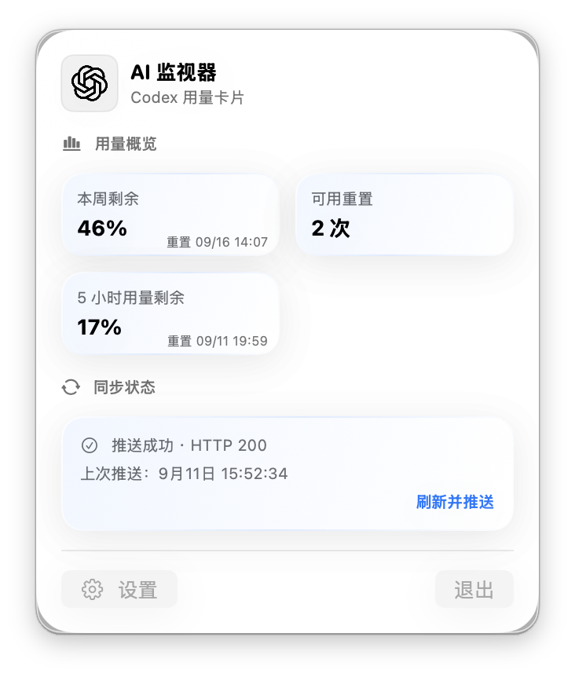
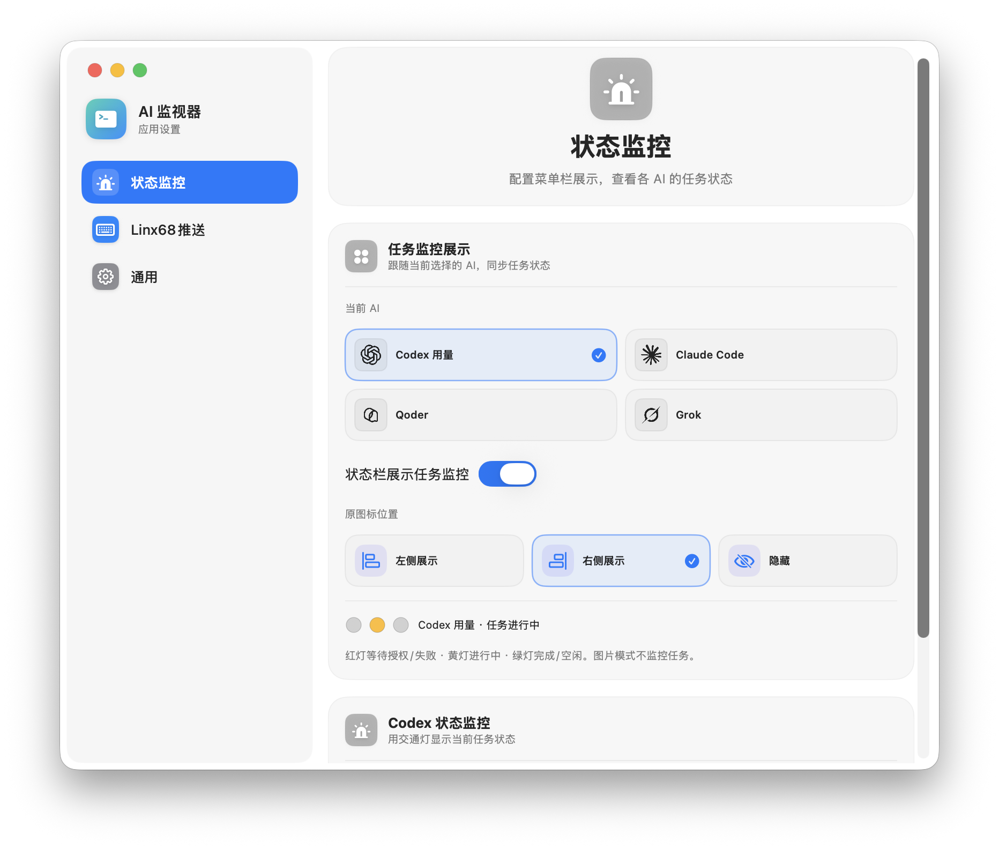

# AI Monitor

一款常驻 macOS 菜单栏的 AI 任务状态与用量监控工具，并可将用量卡片或自定义图片自动推送到 Linx68 键盘屏幕。

<p align="center">
  
</p>

## 功能概览

- **菜单栏快速查看**：集中展示当前 AI 的剩余用量、重置时间、同步结果与最近推送时间。
- **AI 任务状态灯**：使用红、黄、绿三色状态提示等待授权、执行中、完成或空闲。
- **多 AI 支持**：可切换监控 Codex、Claude Code、Qoder 和 Grok。
- **Linx68 自动推送**：定时读取数据、生成 142 × 428 JPEG，并通过局域网接口推送到键盘。
- **丰富卡片样式**：提供多种配色与信息布局，设置中可实时预览最终画面。
- **自定义图片**：自动裁切图片并保留键盘顶部状态栏安全区。
- **应用内更新**：从 GitHub Releases 检查并安装新版本，无需重复手动覆盖应用。

## macOS 风格设置

设置窗口按“状态监控、Linx68 推送、通用”组织，选中颜色会跟随 macOS 的系统强调色。窗口支持缩放，标题与内容可连续滚动。

<p align="center">
  
</p>

## 键盘画面

应用会根据当前数据生成适配 Linx68 竖屏的卡片，显示任务状态、剩余用量、可用重置次数和重置时间。

<p align="center">
  
</p>

## 支持的数据源

| 数据源 | 用量信息 | 任务状态 | 键盘卡片 |
| --- | :---: | :---: | :---: |
| Codex | ✓ | ✓ | ✓ |
| Claude Code | ✓ | ✓ | ✓ |
| Qoder | ✓ | ✓ | ✓ |
| Grok CLI | ✓ | ✓ | ✓ |

任务状态来自本机工具运行记录或 Hook，用量数据仅在本机读取。Linx68 推送请求只发送到你在设置中配置的局域网地址。

## 安装与更新

1. 从 [GitHub Releases](https://github.com/Mean325/AI-Monitor/releases/latest) 下载最新 DMG。
2. 将 **AI Monitor** 拖入“应用程序”并启动。
3. 在“设置 → Linx68 推送 → 连接与同步”中填写键盘图像上传地址。
4. 在“设置 → 通用”中可随时检查更新。

> 首次安装支持应用内更新的版本后，后续版本可以直接在应用中完成下载与替换。

## 本地开发

需要 macOS 14 或更高版本、Xcode 和 [XcodeGen](https://github.com/yonaskolb/XcodeGen)。在项目根目录运行：

```bash
brew install xcodegen
./scripts/run-dev.sh
```

脚本会生成 Xcode 工程、增量构建 Debug 应用、退出旧进程并启动最新版本，不需要反复生成 DMG 或覆盖 `/Applications/AI Monitor.app`。也可以打开生成的工程，选择 `CodexLinxDisplay` Scheme 后按 `Command-R`。

## 版本管理与发布

版本号统一保存在 `Config/Version.xcconfig`：

```bash
./scripts/version.sh current
./scripts/version.sh bump patch
./scripts/version.sh set 1.0.0 10
```

推送与应用版本一致的 `v*` 标签后，GitHub Actions 会构建 DMG/ZIP、生成 Sparkle 更新清单并创建 Release。发布签名、公证和 Sparkle 私钥均由仓库 Secrets 管理。

## 致谢

[CodexLinxDisplay](https://github.com/kkoscielniak/CodexLinxDisplay) — 初始项目来源。
